# SPUR Connect

## Table of Contents

- [Description](#description)
- [Built With](#built-with)
- [Getting Started](#getting-started)
  - [Prerequisites](#prerequisites)
  - [Installation](#installation)
- [Usage](#usage)
- [License](#license)
- [Acknowledgements](#acknowledgements)
- [Contacts](#contacts)

## Description

SPUR Connect exists to give traveling business professional a tool to maximize their time and availability by easing the process of making new professional connections, cold-messaging, and scheduling last-minute meetings. User can get real time information about currently available users who are located near them and open to setting meetings. With a clean, professional, and intuitive mobile-designed interface users are able to schedule meetings, send messages, record notes, and upload photos of receipts for business expenditures.

## Built With

## Getting Started

 -- Replace with Heroku deployment --

### Development Prerequisites

This version uses React, Redux, Express, Passport, and PostgreSQL (a full list of dependencies can be found in `package.json`).

Before you get started, make sure you have the following software installed on your computer:

- [Node.js](https://nodejs.org/en/)
- [PostrgeSQL](https://www.postgresql.org/)
- [Nodemon](https://nodemon.io/)

Create a new database called `spur_connect` and create the tables needed by running SQL statements from the database.sql file.

If you would like to name your database something else, you will need to change `spur_connect` to the name of your new database name in `server/modules/pool.js`

Directory Structure:

- `src/` contains the React application
- `public/` contains static assets for the client-side
- `build/` after you build the project, contains the transpiled code from `src/` and `public/` that will be viewed on the production site
- `server/` contains the Express App

### Installation

Clone the repository and npm install in the terminal.
Then in 2 separate terminals, npm run server in one and npm run client in the other.

## Usage

If you're a new user, register an account to log in. If you're already registered, log in to your existing account.

Upon first-time registration, users will be taken to their profile view. On this view you can choose the "Edit Profile" button at the bottom to add additional information not required at registration.

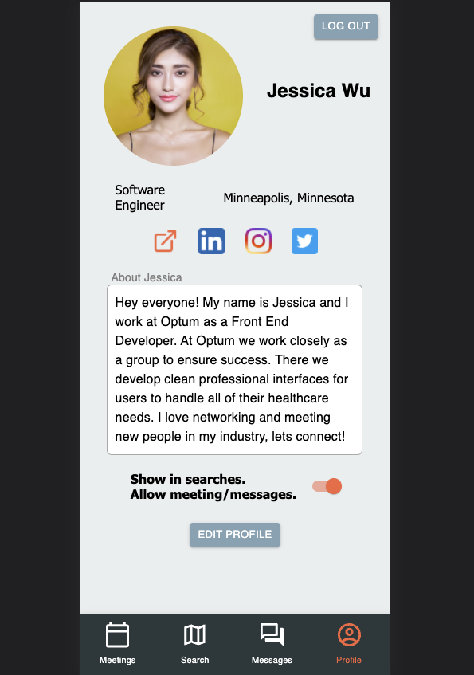

On the Edit Profile view users can change their profile picture, their social media links, their current location, and fill out an "About Me" section.

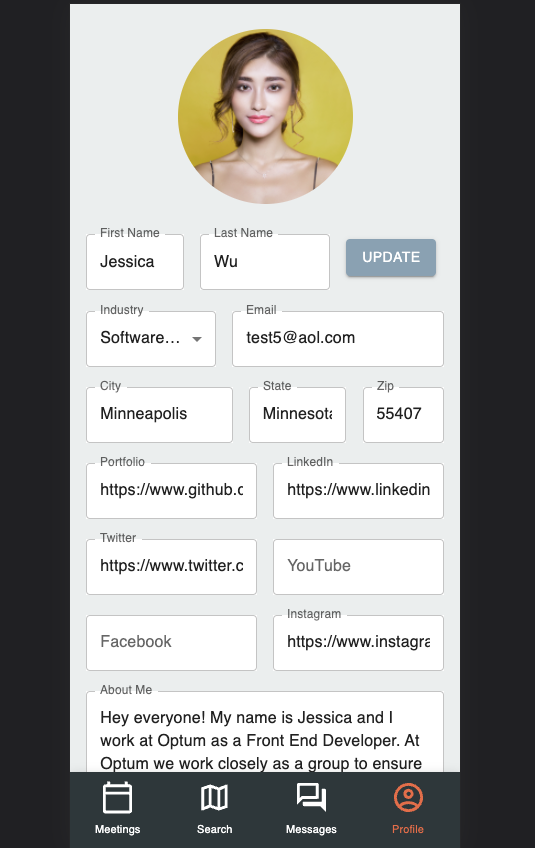

Navigation: Along the bottom of the app is a navigation bar with 4 buttons. When an already registered user logs in they will be taken to the second view on that nav bar, the Search view.

When arriving at the search view, the view is empty and the user is prompted to search for potential connections. At the top right of the view there is an "i" button that shows the user categories they can search by. To the left of that button at the top of the page is the search bar. As the user types in the search bar the page is filled with users and narrowed down as the user keeps typing.

The results from the search are cards showing other user's profile pictures, their industry, and their location. Only users who have their visibility toggled on will be searchable.

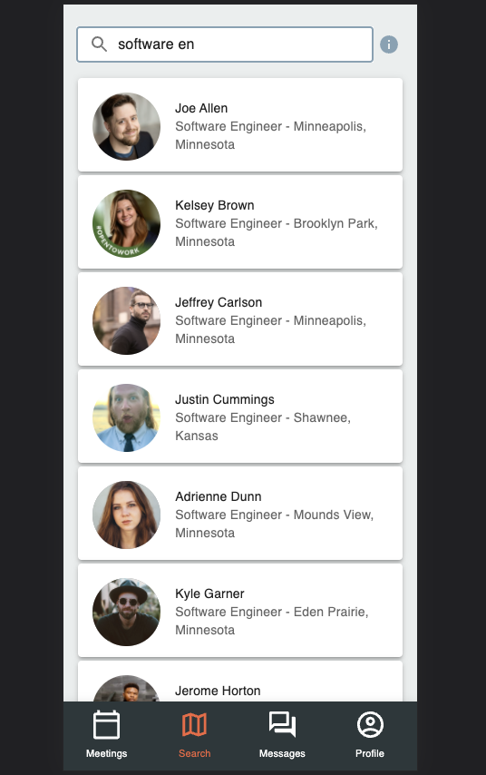

Clicking on the cards will take the user to that other user's profile. 

On another user's profile, their information is shown with links to their social media. On the right side there is a "Say Hello" button that can be used to send the user a message. On the left side there is a "Invite to meet" button that can be used to set up a meeting with the user.

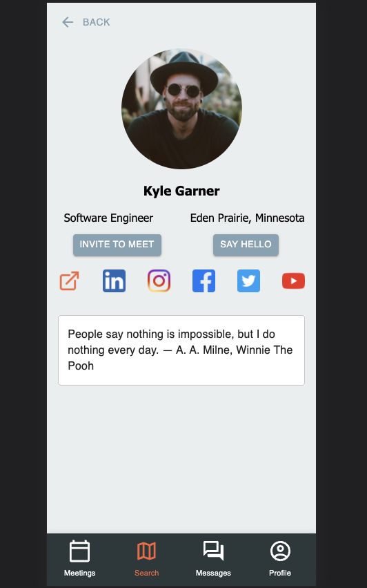

Once a message is sent to the other user, it can be seen by selecting the "Messages" view on the bottom nav bar.

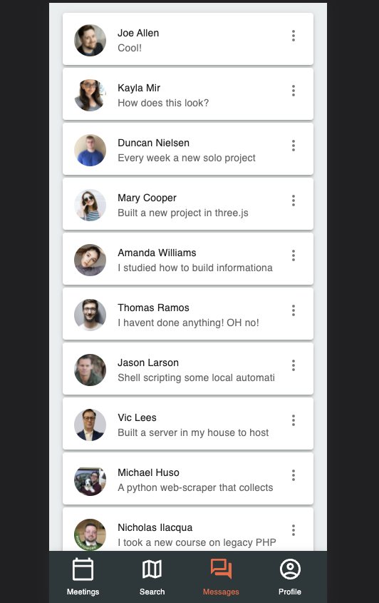

On the messages view, the user is shown a history of their messages with other users. On these cards the user can click the profile picture to be taken to that other user's profile, click the drop down menu on the right to show options that go to the other user's profile, or delete the conversation. If the user clicks anywhere else on the card they will be taken to the conversation with the other user.

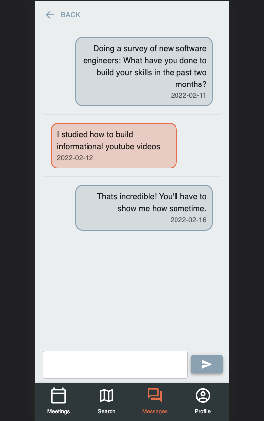

When in a conversation view, the messages from other users are shown in orange and are on the left side of the view. Your own messages are shown on the right side of the view. Timestamps are shown at the bottom of each message. At the bottom of the page a chat box is shown with a send button at the right of it. A back button at the top left of the view will return the user to the message history view.

On another user's profile, when "Invite to Meet" is selected, the user will be taken to  the "Add a meeting" view. On this view, the other user's name and profile picture are shown, with inputs for a meeting title, location for the meeting, a summary of the meeting, and a date and time for the meeting. When finished filling out the details the meeting can be scheduled by selecting "Schedule".

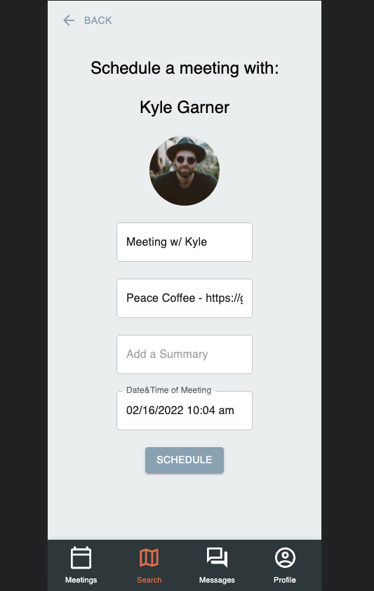

Selecting schedule will take the user to the "Meetings history" view. This view can also be accessed by selecting far left icon "Meetings" on the bottom nav bar. On this view the user can see a history of all of their scheduled and prior meetings.

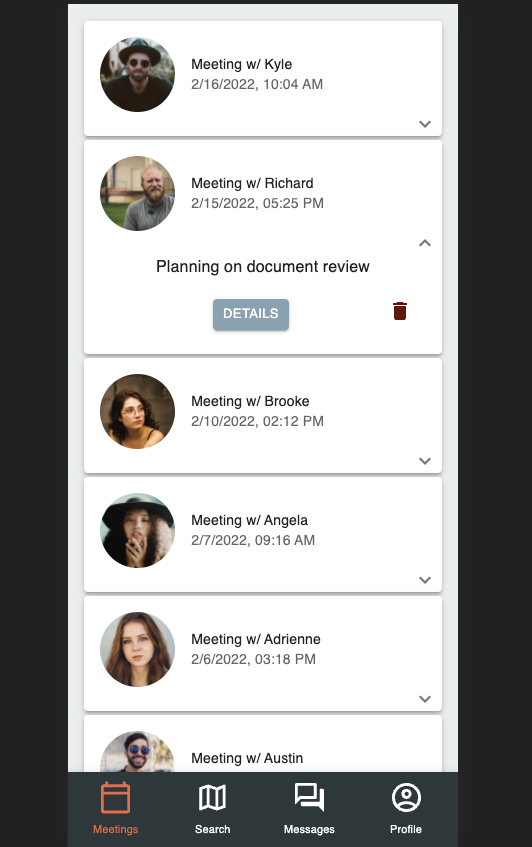

Each meeting is shown with a card. The other user's profile picture is shown on the card corresponding with their meeting. The title of the meeting is shown as well as a timestamp for when the meeting was scheduled.

Selecting one of the cards shows a dropdown menu for that specific meeting. On the right is a trashcan icon that will delete the meeting. There is also a "Details" button that will take the user to the specific details of that meeting.

When in selected meeting view, a top nav bar is shown for the different views of that meeting. The default view when arriving is the "Details" view. On this page the details of the selected meeting are shown along with the location of the meeting, time of the meeting, and the summary. An "Edit Details" button at the bottom allows the user to change these details. 

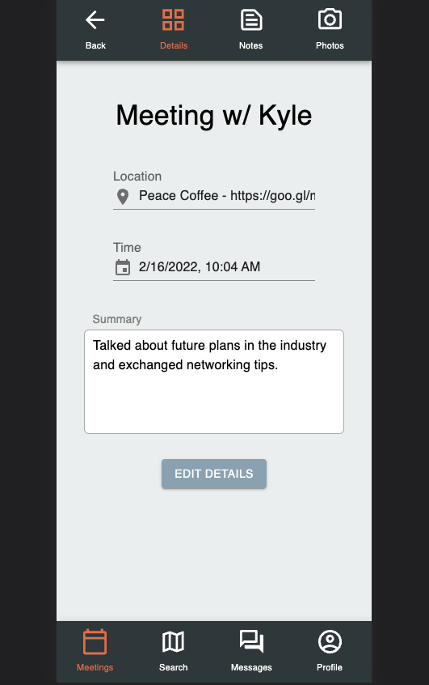

At far right of the top nav bar is a camera icon. When selected this will take the user to the "Photos" view for the selected meeting. This view has an "Upload" button that allows the user to drag or select a photo to be uploaded for the meeting. Already selected uploads are shown as thumbnails on the view. When a thumbnail is selected a menu is shown with options to take the user to a full size view of the image, delete the image, or cancel.

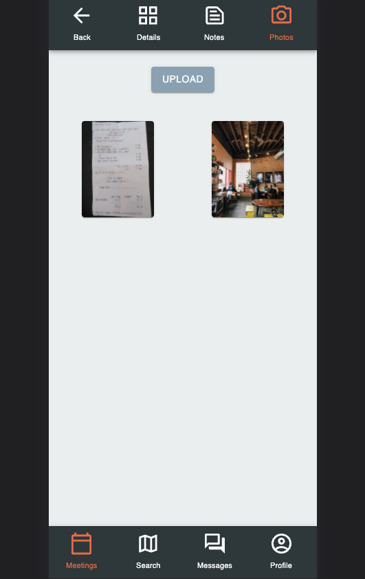

Next to the camera icon is a note icon. When selected the user will be taken to the "Notes" page for the selected meeting. This page has a 1000 character limit for any notes the user wants to keep for the meeting. A clear button at the bottom left will clear the notes entirely. A save button at the bottom right will save the notes that are entered.

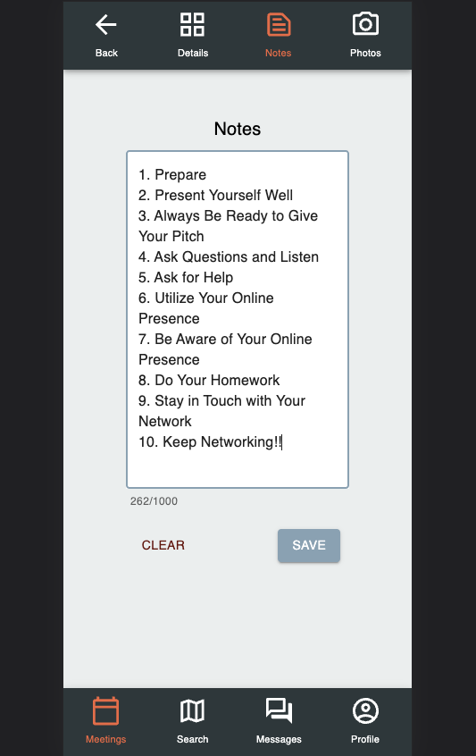

When finished using the app, a user can go to the profile page by selecting the profile icon on the bottom nav bar at the far left. At the top right of the profile view is a "Log Out" button. This will log them out of the app.

## Acknowledgements

Thank you to Brandon Hlavka and Kristy Dahlvang for having the SPUR Connect vision. Thank you to the SPUR Connect Prime Digital Academy team who helped make that vision a reality.

- [Kayla Mir](https://github.com/Kayla-Mir)
- [Joe Allen](https://github.com/AllenJoeG)
- [Michael Huso](https://github.com/husomichael)
- [Nicholas Ilacqua](https://github.com/IlacquaNicholas)
- [Victor Lees](https://github.com/vlees46)
- [Duncan Nielsen](https://github.com/duncann008)

## Contacts

  
